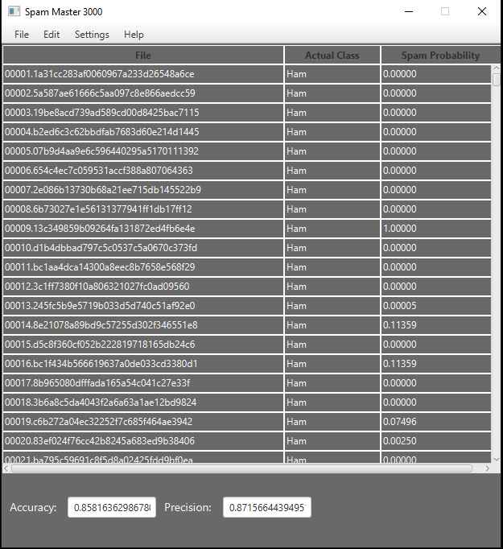

a.Project information:
This project  a spam detector to filter out email spam. The spam detector used a dataset of E-Mails (spam or otherwise)
to learn to recognize whether or not new E-Mails are spam. The project uses a unigram approach. Each word is counted
and associated with whether or not the message is spam. it then calculate probabilities based on each word’s frequency

b.Improvements:
A simple menu bar was added to make the program feel more natural. Dark mode was also added as a way to break monotony.
Also, Counter.java is a command line representation of the project

c. Please clone the project from GitHub by using git pull command.
To run the project, open the folder in IntelliJ, make sure to use azul version 13, run the program and it will prompt
to choose a folder. Please choose the folder data and select folder. Then it will display the output.

!
